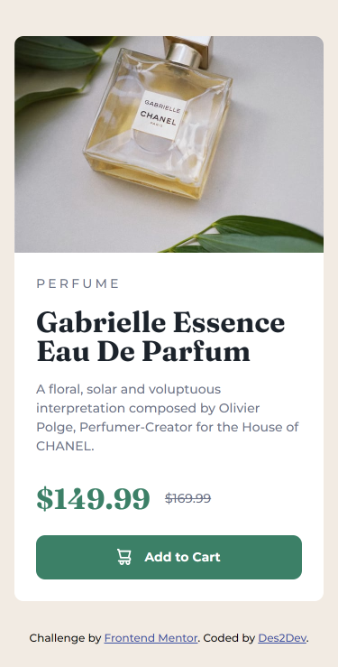

# Frontend Mentor - Product preview card component solution

This is a solution to the [Product preview card component challenge on Frontend Mentor](https://www.frontendmentor.io/challenges/product-preview-card-component-GO7UmttRfa). Frontend Mentor challenges help you improve your coding skills by building realistic projects.

## Table of contents

1. [Frontend Mentor - Product preview card component solution](#frontend-mentor---product-preview-card-component-solution)
   1. [Table of contents](#table-of-contents)
   2. [Overview](#overview)
      1. [The challenge](#the-challenge)
      2. [Screenshot](#screenshot)
      3. [Links](#links)
   3. [My process](#my-process)
      1. [Built with](#built-with)
      2. [What I learned](#what-i-learned)
      3. [Useful resources](#useful-resources)
   4. [Author](#author)

## Overview

### The challenge

Users should be able to:

- View the optimal layout depending on their device's screen size
- See hover and focus states for interactive elements

### Screenshot




### Links

- [Solution URL here](https://your-solution-url.com)
- [Live site URL here](https://des2dev.github.io/product-preview-card-component/)

## My process

### Built with

- Semantic HTML5 markup
- CSS custom properties
- Flexbox
- Mobile-first workflow
- BEM methodology

### What I learned

I learned how to use `<picture>` element for displaying **different images** based on **different screen sizes**.

And use of `<picture>` element _reduces the work amount, complexity and use of **media queries** (`@media`)_

example :

```html
example 1

<picture>
  <source media="(min-width: 600px)" srcset="./image/desktop-view.png" />
  
</picture>
```

```html
example 2

<picture>
  <source media="(min-width: 768px)" srcset="./image/desktop-view.png" />
  <source media="(min-width: 375px)" srcset="./image/tablet-view.png" />
  
</picture>
```

In above example 2,

- if the screen is a mobile screen (375px wide or less), then you see the mobile-view.png
- if the screen is a tablet screen (768px wide or less), then you see the tablet-view.png
- and if it is large screen (greater than 768px), then you can see the desktop-view.png

### Useful resources

- [CSS custom properties](https://developer.mozilla.org/en-US/docs/Web/CSS/Using_CSS_custom_properties)
- [Flexbox](https://developer.mozilla.org/en-US/docs/Web/CSS/CSS_Flexible_Box_Layout/Basic_Concepts_of_Flexbox)
- [BEM methodology](https://en.bem.info/methodology/)
- [`<picture>` element](https://developer.mozilla.org/en-US/docs/Web/HTML/Element/picture)

## Author

- Frontend Mentor - [@Des2Dev](https://www.frontendmentor.io/profile/Des2Dev)
